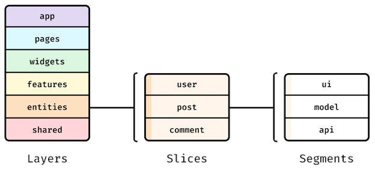

# Feature-Sliced Design (FSD) for front-end applications
https://feature-sliced.design/docs/get-started/overview

In FSD, a project consists of 
  1. *layers*, each *layer* is made up of 
  2. *slices* and each *slice* is made up of 
  3. *segments*

App consists from vertically arranged *layers*. ❗️Code on one *layer* can only interact with code from the *layers* strictly below.

## Layers

### 1. `shared/`
  Reusable functionality, detached from the business (e.g. UIit, libs, API). ❗️No business logic here.
### 2. `entities/`
  Business related components with slots for content and the interactive elements (e.g. BlogPost, User, Order, Product).  
  Each *slice* in this *layer* contains static UI elements, data stores and CRUD operations.
### 3. `features/` 
  Actions that a user (or app) makes with business *entities* to achieve a valuable outcome (create-blog-post, login-by-oauth, edit-account, publish-video).  
  Each *slice* in this *layer* can contain interactive UI elements, internal state and API calls that enable value-producing actions.
### 4. `widgets/` 
  Compositional *layer* to combine *entities* and *features* into meaningful blocks (e.g. "assembled" PostCard, IssuesList, UserProfile with content and interactive buttons wired to the api calls).  
  This *layer* provides a way to fill in the slots left in the UI of *Entities* with other *Entities* and interactive elements from *Features*. ❗️In most cases no business logic here.
### 5. `pages/` 
  Compositional layer to construct full pages from *entities*, *features* and *widgets* (e.g. route components for each page in the app, should have minimum logic). ❗️No business and minimum other logic here.
### 6. `app/` 
  App-wide settings, (e.g. styles, providers, router, store...).

https://feature-sliced.design/docs/reference/layers

❗️It might be not clear what goes into *Entities* and *Features*. Do not worry. Just put logic into *Widgets*. You will feel later if it should be divided into *Entities* and *Features*.

## Slices
  - A *layer* is divided into business oriented *slices* to keep related code together (e.g. post,add-user-to-friends, news-feed...)
  - `Shared` and `App` *layers* never have *slices* (no business logic inside).
  - ❗️*Slices* cannot use other *slices* on the same *layer*.
  - ❗️*Slice* (and *segment* without *slices*) must contain the `index.ts` entry points with re-exports (public API). Code outside should not reference internal *slice* file structure, but public API.

## Segments
  A *slice* consists of *segments* to separate code by its technical nature, common *segments* are:
  1. `ui/` ui-logic, components
  2. `model/` business logic, store, actions, selectors
  3. `lib/` utils, helpers, hooks
  4. `api/` communication with external APIs, backend API methods

  ❗️*Segments* structure can be modified.